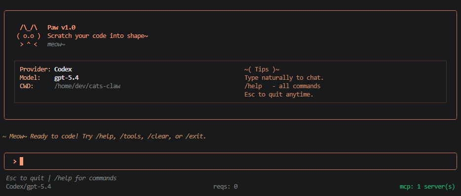

# Paw 🐱

```
  /\_/\   Paw
 ( o.o )  Scratch your code into shape~
  > ^ <
```

Multi-provider AI coding agent for the terminal. Smart routing, solo or team mode, MCP support, session sync, skills, hooks, and automatic fallback.



> **Disclaimer:** Paw is an independent, third-party project. It is not affiliated with, endorsed by, or sponsored by Anthropic, OpenAI or any AI provider. Claude, Codex, GPT, and related names are trademarks of their respective owners.

## Architecture

```
                         paw (CLI)
                            │
              ┌─────────────┼─────────────┐
              │             │             │
          paw mcp       paw --help    paw [prompt]
          (manage)      (info)        (main flow)
                                         │
                                   ┌─────┴─────┐
                                   │ Auto-Detect│
                                   │ Anthropic  │
                                   │  Codex CLI │
                                   │  Ollama    │
                                   └─────┬─────┘
                                         │
                               ┌─────────┼─────────┐
                               │  Init (parallel)   │
                               │  MCP + Team detect │
                               │  + Session restore │
                               │  + Hooks load      │
                               └─────────┬─────────┘
                                         │
                                   ┌─────┴─────┐
                                   │   REPL     │
                                   │  (Ink UI)  │
                                   └─────┬─────┘
                                         │
                           ┌─────────────┼─────────────┐
                           │             │             │
                     /commands      Solo Mode      Team Mode
                           │             │               │
                           │      ┌──────┴──┐    ┌──────┴───────┐
                           │      │Provider │    │Plan → Code → │
                           │      │  Call   │    │[Review+Test] │
                           │      └────┬────┘    │  → Optimize  │
                           │           │         └──────┬───────┘
                           │      ┌────┴────┐          │
                           │      │ 8 Tools │     Fallback
                           │      │ + MCP   │     on error
                           │      └────┬────┘          │
                           │           └────────┬──────┘
                           │                    │
                           │             ┌──────┴──────┐
                           └────────────▶│  Response   │
                                         │  + Session  │
                                         │  + Hooks    │
                                         │  + Sync     │
                                         └─────────────┘
```

### Fallback

```
Provider Call → Success → Response
      │
      └─ Error (429/401/quota) → Next Provider → ... → Ollama (last resort)
```

### Team Pipeline

```
Plan(sequential) → Code(sequential) → [Review + Test](parallel) → Optimize(sequential)

Example:  anthropic → planner, reviewer, optimizer
          codex     → coder (score: 9)
          ollama    → tester (unique spread)
```

## Features

- **3 Providers** — Anthropic (API), Codex (CLI), Ollama (local)
- **Auto-detect** — No login prompt; finds Codex CLI and Ollama automatically
- **Solo/Team mode** — Single provider or 5-agent pipeline in one terminal
- **Session sync** — Conversations persist and sync across terminals in real-time (fs.watch)
- **Resume** — `--continue` or `--session <id>` to pick up where you left off
- **Arrow-key UI** — All panels: ↑↓ navigate, Enter select, Esc back
- **Effort levels** — Codex: low/medium/high/max (configurable per model and per team role)
- **MCP support** — External tools via Model Context Protocol (stdio/http/sse)
- **Skills** — 7 built-in slash commands + user/project custom skills
- **Hooks** — Event-driven automation: pre-turn, post-turn, pre-tool, post-tool, on-error, session-start, session-end
- **Auto-fallback** — Rate limit? Instantly tries next provider
- **Live Ollama detection** — Shows actually pulled models with sizes
- **Usage tracking** — Per-provider token count with estimated cost
- **Korean IME** — Native stdin handling for smooth CJK input
- **Autocomplete** — `/` triggers command list; Enter executes, Tab fills
- **Security hardened** — Injection protection, SSRF blocking, symlink guards
- **`/auto` mode** — Autonomous agent: plan → execute → verify → fix loop until done
- **`/pipe` mode** — Feed shell output to AI: analyze, auto-fix errors, or watch commands
- **Smart Router** — Auto-detects best mode from your message (EN/KO/JA/ZH)

## Requirements

- Node.js 22+
- npm
- At least one: Anthropic API key, Codex CLI, or Ollama

## Installation

```bash
git clone https://github.com/jhcdev/paw.git
cd paw
npm install
npm link    # Installs 'paw' command globally
```

## Quick Start

```bash
paw                                # Auto-detect and start REPL
paw --provider codex               # Force Codex
paw --provider ollama              # Force Ollama
paw "explain this project"         # Direct prompt, no REPL
paw "/team implement JWT auth"     # Team mode prompt
paw --continue                     # Resume last session
paw -c "what did I say before?"    # Resume + prompt
paw --session abc123               # Join specific session
```

## Providers

| Provider | Auth | How it works |
|----------|------|-------------|
| **Anthropic** | API key (`ANTHROPIC_API_KEY`) | Claude models, best reasoning |
| **Codex** | `codex login` | Runs `codex exec` with ChatGPT subscription |
| **Ollama** | (none) | Connects to local Ollama server |

### Anthropic

API key from [console.anthropic.com](https://console.anthropic.com). Best for reasoning and planning.

```bash
# Set in .env
ANTHROPIC_API_KEY=sk-ant-api03-...
# Or configure in REPL
/settings → Anthropic → enter API key
```

Models: Haiku 4.5 (fast), Sonnet 4/4.6 (balanced), Opus 4/4.6 (powerful).
Pricing: per-token (e.g. Sonnet $3/1M input, $15/1M output).

### Codex

Auto-detected if Codex CLI is installed. Uses ChatGPT subscription — no API key needed.

```bash
npm install -g @openai/codex
codex login
paw --provider codex
```

Effort: low, medium (default), high, extra_high

Models: GPT-5.4, GPT-5.4 Mini, GPT-5.3 Codex, GPT-5.3 Codex Spark, GPT-5.2 Codex, GPT-5.2, GPT-5.1 Codex Max/Mini, o4 Mini, o3

### Ollama (Local)

Free, no account. Runs models on your machine.

```bash
ollama pull qwen3
paw --provider ollama
```

Hardware: 16GB RAM minimum, GPU recommended.

### Coming Soon

- **Gemini** — Google Gemini API
- **Groq** — Fast inference
- **OpenRouter** — Multi-model hub

## Sessions

Conversations auto-save and sync across terminals.

```bash
paw                          # New session (auto-generated ID)
paw --continue               # Resume last session
paw -c "continue working"    # Resume + prompt
paw --session abc123         # Join specific session
```

### Real-time Sync

Two terminals with the same session ID see each other's messages instantly (fs.watch, 50ms debounce).

```
Terminal A: paw --session abc123
Terminal B: paw --session abc123
→ Both see the same conversation, synced in real-time
```

### Session Files

Stored in `~/.paw/sessions/{id}.json` (mode 0600).

## Skills

Skills are slash commands that prepend a focused prompt to your message.

### Built-in Skills (7)

| Skill | Description |
|-------|-------------|
| `/review` | Review code for bugs, security, and best practices |
| `/refactor` | Suggest refactoring improvements |
| `/test` | Generate test cases |
| `/explain` | Explain code in detail |
| `/optimize` | Optimize code for performance |
| `/document` | Generate documentation |
| `/commit` | Generate a conventional commit message from git diff |

### Using Skills

```
you  /review src/auth.ts
you  /commit
you  /explain this function
```

### Custom Skills

Create user-wide or project-scoped skills as JSON files:

**User skill** — `~/.paw/skills/deploy.json`:
```json
{
  "name": "deploy",
  "description": "Check deployment readiness",
  "prompt": "Review this code for production deployment: check env vars, error handling, logging, and security."
}
```

**Project skill** — `.paw/skills/style.json`:
```json
{
  "name": "style",
  "description": "Enforce project style guide",
  "prompt": "Review this code against our style guide: 2-space indent, no var, prefer const, JSDoc on exports."
}
```

Skills load automatically on startup. Use `/skills` to list all available skills.

## Hooks

Hooks let you run shell commands at specific points in the REPL lifecycle.

### Events

| Event | When |
|-------|------|
| `pre-turn` | Before sending a message to the model |
| `post-turn` | After the model responds |
| `pre-tool` | Before a tool is executed |
| `post-tool` | After a tool finishes |
| `on-error` | When any error occurs |
| `session-start` | When the REPL session starts |
| `session-end` | When the REPL session ends |

### Configuration

Create `.paw/hooks.json` in your project (or `~/.paw/hooks.json` for user-wide hooks):

```json
{
  "hooks": [
    {
      "name": "log-turns",
      "event": "post-turn",
      "command": "echo 'Turn complete' >> ~/.paw/activity.log"
    },
    {
      "name": "lint-on-tool",
      "event": "post-tool",
      "command": "npm run lint --silent 2>/dev/null || true",
      "timeout": 15000
    },
    {
      "name": "notify-start",
      "event": "session-start",
      "command": "notify-send 'Cat\\'s Claw' 'Session started'"
    },
    {
      "name": "git-status",
      "event": "pre-turn",
      "command": "git status --short"
    }
  ]
}
```

### Context Variables

Hooks receive environment variables:

| Variable | Value |
|----------|-------|
| `CATS_CLAW_EVENT` | The event name |
| `CATS_CLAW_CWD` | Current working directory |

Use `{{key}}` placeholders in commands to interpolate context values. Hooks time out after 10s by default (configurable per hook via `timeout` in ms).

## Provider Settings (`/settings`)

Manage providers via arrow-key panel:

```
╭─ Provider Settings ──────────────────╮
│  > ● Anthropic (active)              │
│    ● Codex                           │
│    ● Ollama (local)                  │
│  ↑↓ navigate  Enter select  Esc back │
╰──────────────────────────────────────╯
```

Select → choose login or API key → configured.

## Model Selection (`/model`)

Arrow-key panel showing plan-filtered models. Ollama shows actually pulled models:

```
╭─ Model Selection ────────────────────╮
│ Active: codex/gpt-5.4                │
│ Select provider:                     │
│  > anthropic                         │
│    codex                             │
│    ollama                            │
│  ↑↓ navigate  Enter select  Esc back │
╰──────────────────────────────────────╯
         ↓ Enter
╭─ Select model ───────────────────────╮
│  > gpt-5.4 — GPT-5.4                │
│    gpt-5.4-mini — GPT-5.4 Mini      │
│    o4-mini — o4 Mini                 │
│  ↑↓ navigate  Enter select  Esc back │
╰──────────────────────────────────────╯
         ↓ Enter (Anthropic)
╭─ Select model ───────────────────────╮
│  > claude-haiku-4-5 — Haiku 4.5     │
│    claude-sonnet-4 — Sonnet 4        │
│    claude-sonnet-4-6 — Sonnet 4.6    │
│    claude-opus-4 — Opus 4            │
│    claude-opus-4-6 — Opus 4.6        │
│  ↑↓ navigate  Enter select  Esc back │
╰──────────────────────────────────────╯
         ↓ Enter (Codex)
╭─ Select effort ──────────────────────╮
│    Low — Fast, lighter reasoning     │
│  > Medium — Balanced (default)       │
│    High — Complex problems           │
│    Extra High — Maximum depth        │
│  ↑↓ navigate  Enter select  Esc back │
╰──────────────────────────────────────╯
```

Direct command also works: `/model codex 3` or `/model ollama qwen3`

## Modes

One terminal, two modes. Switch anytime.

### Solo Mode (default)

```
/mode solo
```

Single provider handles all messages.

### Team Mode

```
/mode team
```

5 agents collaborate on every message:

| Role | Job | Runs |
|------|-----|------|
| Planner | Architecture & plan | Sequential |
| Coder | Implementation | Sequential |
| Reviewer | Bugs, security | **Parallel** |
| Tester | Test cases | **Parallel** |
| Optimizer | Performance | Sequential |

### Team Dashboard (`/team`)

```
╭─ Team Dashboard ─────────────────────╮
│  planner   codex/gpt-5.4            │
│  coder     codex/gpt-5.4            │
│  reviewer  codex/gpt-5.4            │
│  tester    ollama/qwen3             │
│  optimizer codex/gpt-5.4            │
│                                      │
│  > Edit role assignment              │
│    Toggle mode (→ team)              │
│  ↑↓ navigate  Enter select  Esc back │
╰──────────────────────────────────────╯
```

### Team Role Editing

Full arrow-key flow: **pick role → pick provider → pick model → pick effort**

After each role change, returns to role selection for more edits. Esc to exit.

```
Select role → coder
Select provider → codex
Select model → gpt-5.4
Select effort → high
~ coder → codex/gpt-5.4 (effort: high)
→ Back to role selection
```

### Auto-Assignment

Roles assigned by efficiency scores (greedy unique-first). Adapts from real usage after 3+ runs per role. Scores stored in `~/.paw/team-scores.json`.

### Automatic Fallback

Provider fails → instantly tries next. Ollama = local fallback (free, no rate limits).

## Paw Exclusive Features

### `/auto` — Autonomous Agent

Runs a self-driving agent that works until the task is done — no manual intervention.

```
/auto add input validation to all API endpoints
/auto refactor the auth module to use JWT
/auto fix all TypeScript errors in the project
```

Flow:
```
◉ Analyzing project...          (reads files, package.json)
✓ Creating plan...               (step-by-step actions)
◉ Executing step 1/10...        (reads/writes/runs commands)
◉ Executing step 2/10...
◉ Verifying...                   (runs build + tests)
✗ Build error found
◉ Fixing errors...               (auto-patches code)
◉ Verifying...
✓ All checks passed
✓ COMPLETED (32.4s)
```

- Plans work, executes with tools, verifies with build/test
- Auto-fixes errors and retries (max 10 iterations)
- Multi-provider: fallback if one provider fails mid-task

### `/pipe` — Shell Output → AI

Feeds real terminal output directly to the AI for analysis or automatic fixing.

```
/pipe npm test              → AI analyzes test failures
/pipe fix npm run build     → AI fixes build errors, re-runs until clean
/pipe fix tsc --noEmit      → AI fixes type errors automatically
/pipe watch npm start       → AI monitors startup output
```

Three modes:
| Mode | Command | What happens |
|------|---------|-------------|
| Analyze | `/pipe <cmd>` | Run → AI explains output |
| Fix | `/pipe fix <cmd>` | Run → AI fixes errors → re-run (loop, max 5) |
| Watch | `/pipe watch <cmd>` | Run with timeout → AI analyzes |

Example fix loop:
```
Running (1/5): npm run build
Errors found — fixing (1/5)...
Running (2/5): npm run build
Errors found — fixing (2/5)...
Running (3/5): npm run build
Pass — no errors
FIXED after 3 iteration(s) (18.2s)
```

### Smart Router — Auto Mode Selection

No need to remember commands. Just type naturally — Paw picks the best execution mode automatically.

| You type | Paw routes to | Why |
|----------|--------------|-----|
| `npm test` | `/pipe` | Shell command detected |
| `implement JWT auth` | `/auto` | Complex implementation task |
| `review this code` | `/review` skill | Code review pattern |
| `이 코드 리뷰해줘` | `/review` skill | Korean skill match |
| `모든 에러 수정해줘` | `/auto` | Korean auto task |
| `tsc --noEmit` | `/pipe` | Shell command |
| `hello` | solo | Simple message |

Supports: English, Korean, Japanese, Chinese.
CJK-aware (shorter messages still trigger correctly).
Disable with explicit `/` commands to override routing.

## Tools (8 built-in)

| Tool | Description |
|------|-------------|
| `list_files` | List files and directories |
| `read_file` | Read a text file (size guard) |
| `write_file` | Create or overwrite a file |
| `edit_file` | Replace a unique string |
| `search_text` | Search patterns (no injection) |
| `run_shell` | Shell commands (dangerous blocked) |
| `glob` | Find files by pattern (ReDoS-safe) |
| `web_fetch` | Fetch URL (SSRF-protected) |

## MCP (Model Context Protocol)

### CLI

```bash
paw mcp add --transport http github https://api.github.com/mcp \
  --header "Authorization:Bearer token"
paw mcp add --transport stdio memory -- npx -y @modelcontextprotocol/server-memory
paw mcp list
paw mcp remove github
```

### Interactive (`/mcp`)

```
╭─ MCP Server Manager ────────────────╮
│  ● github — 12 tool(s)              │
│  ● memory — 9 tool(s)               │
│  > Add server                        │
│    Remove server                     │
│    Back                              │
│  ↑↓ navigate  Enter select  Esc back │
╰──────────────────────────────────────╯
```

Supports stdio, HTTP, SSE. Tools auto-injected into all providers. Failed connections show error and aren't saved.

## REPL Commands

| Command | Description |
|---------|-------------|
| `/help` | Show all commands |
| `/status` | Providers, usage, cost |
| `/settings` | Provider management (↑↓) |
| `/model` | Model catalog & switch (↑↓) |
| `/team` | Team dashboard (↑↓) |
| `/skills` | List all skills (built-in + custom) |
| `/hooks` | List loaded hooks and events |
| `/ask <provider> <prompt>` | Query specific provider |
| `/tools` | Built-in + MCP tools |
| `/mcp` | MCP server manager (↑↓) |
| `/git` | Status + diff + log |
| `/sessions` | List past sessions |
| `/session` | Current session ID |
| `/history` | Export chat to markdown |
| `/compact` | Compress conversation |
| `/init` | Generate CONTEXT.md |
| `/doctor` | Diagnostics |
| `/clear` | Reset conversation |
| `/exit` | Quit |
| `/auto <task>` | Autonomous agent mode |
| `/pipe <cmd>` | Feed shell output to AI (fix/watch) |

### Keyboard

| Key | Action |
|-----|--------|
| `↑↓` | Navigate menus |
| `Enter` | Select / execute autocomplete |
| `Tab` | Autocomplete (fill only) |
| `Esc` | Go back / quit |
| `Ctrl+L` | Clear conversation |
| `Ctrl+K` | Compact conversation |

### Status Bar

```
anthropic:2r 1.5k $0.003  codex:5r  ollama:3r 8.2k  mcp: 1
TEAM/gpt-5.4               turns: 2  mcp: off           local
```

## Security

- **Shell**: dangerous patterns blocked (rm -rf /, mkfs, etc.)
- **Search**: no shell injection (uses execFile, not shell)
- **Files**: symlink traversal protection (realpath check)
- **Web**: SSRF blocked (private IPs, metadata endpoints)
- **MCP**: safe env allowlist (API keys not leaked to child processes)
- **Credentials**: mode 0600
- **Glob**: ReDoS-safe regex conversion

## Files

| File | Purpose |
|------|---------|
| `~/.paw/credentials.json` | API keys (0600) |
| `~/.paw/sessions/*.json` | Session history (0600) |
| `~/.paw/team-scores.json` | Team performance |
| `~/.paw/skills/*.json` | User-wide custom skills |
| `~/.paw/hooks.json` | User-wide hooks |
| `.paw/skills/*.json` | Project-scoped custom skills |
| `.paw/hooks.json` | Project-scoped hooks |
| `.mcp.json` | MCP config |
| `.env` | Environment (optional) |

```bash
paw --list              # Show saved credentials
paw --logout            # Remove all saved keys
paw --logout codex      # Remove specific key
```

## Examples

### Solo Mode

```
you  explain the structure of this project
=^.^= says:
  This project has the following structure...

you  /model codex 1
~ codex/gpt-5.4 (effort: medium)

you  /status
~ Active: codex/gpt-5.4
  Usage: codex/gpt-5.4  500 in / 300 out  (free)
```

### Skills

```
you  /review src/auth.ts
=^.^= Reviewing for bugs, security, and best practices...

you  /commit
=^.^= feat(auth): add JWT token validation with expiry check

you  /explain
=^.^= This module handles...
```

### Hooks

```bash
# .paw/hooks.json
{
  "hooks": [
    { "event": "post-tool", "command": "npm test --silent", "name": "auto-test" }
  ]
}
# → tests run automatically after every tool call
```

### Team Mode

```
you  /mode team
you  implement JWT auth

=^.^= Planning (codex/gpt-5.4)...
=^.^= Implementing (codex/gpt-5.4)...
=^.^= Reviewing (codex/gpt-5.4)...
=^.^= Testing (ollama/qwen3)...
=^.^= Optimizing (codex/gpt-5.4)...
Total: 21400ms
```

### Session Resume

```bash
paw "remember: secret code is TIGER42"
# Later, in any terminal:
paw --continue "what is the secret code?"
# → "The secret code is TIGER42"
```

### Cross-Provider Query

```
you  /ask codex refactor this function
=^.^= [codex] Here's the refactored version...

you  /ask ollama review this code
=^.^= [ollama] LGTM with one suggestion...
```

### Fallback

```
you  analyze this codebase
[Fallback: ollama/qwen3]
  Rate limit hit. Switched automatically.
```

## Changelog

### Major Milestones

1. **Initial release** — Multi-provider REPL with Ink UI, 8 tools, cat theme
2. **MCP support** — stdio/HTTP/SSE transport, interactive manager, CLI commands
3. **Team mode** — 5-agent pipeline with parallel execution, efficiency scoring
4. **Auto-detect** — Codex login, no startup prompt needed
5. **Arrow-key UI** — All panels redesigned for ↑↓ + Enter + Esc
6. **Plan-aware models** — Subscription-based filtering, live Ollama detection
7. **Codex provider** — Replaced OpenAI API with Codex CLI (ChatGPT subscription)
8. **Effort levels** — Configurable per model and per team role
9. **Sessions** — Auto-save, resume, real-time sync across terminals
10. **Korean IME** — Native stdin handling, smooth CJK input
11. **Security audit** — 14 vulnerabilities fixed (injection, SSRF, symlink, permissions)
12. **`paw` CLI** — 3-character global command
13. **Anthropic removed** — Moved to separate plugin [jhcdev/paw-anthropic](https://github.com/jhcdev/paw-anthropic)
14. **Skills system** — 7 built-in skills + user/project custom skills via JSON files
15. **Hooks system** — Event-driven automation with 7 lifecycle events and shell command execution
16. **Anthropic provider** — API key mode with per-token pricing
17. **`/auto` mode** — Autonomous plan→execute→verify→fix agent loop
18. **`/pipe` mode** — Shell output → AI analysis/fix/watch
19. **Smart Router** — Auto-detect best mode from message content (multilingual)

## License

MIT
